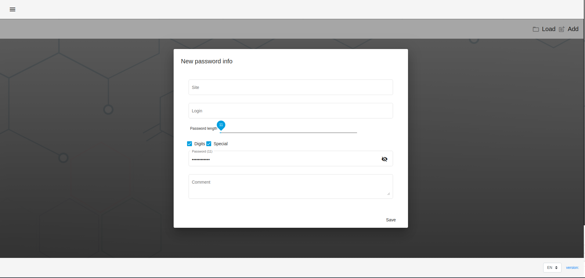
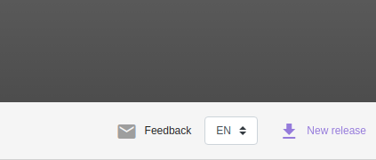
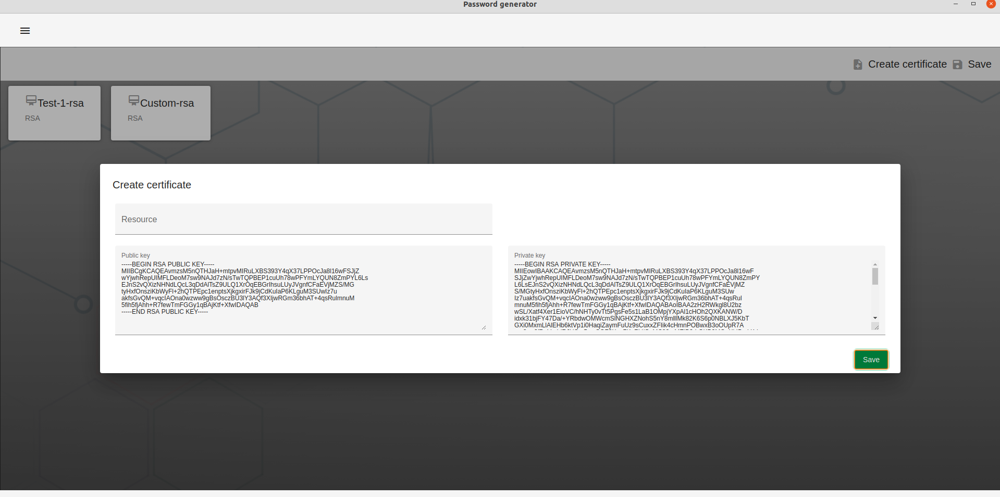

# Password generator

# Introduction

 

This project was generated with [Angular CLI](https://github.com/angular/angular-cli) version 10.1.3.

### Facilities

## Create a card with password and resource information

* Saving a set of cards to a file
* Loading a set of cards from a file
* Contextual search in a set of cards
* Application versions for different operating systems
* Copying the password to the clipboard by pressing a button
* Opening a web resource by clicking on a link
* Popular installers
* Tray app
## New version notification

## Options view 

## 2FA 

## Localization

## Create certificate RSA

## Downloads

